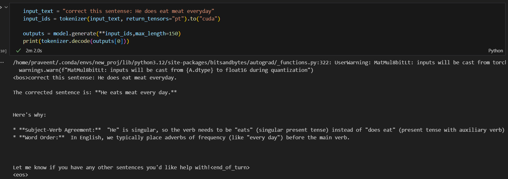
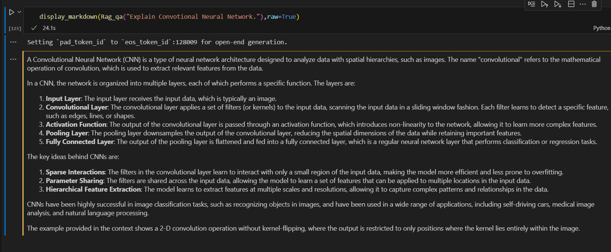
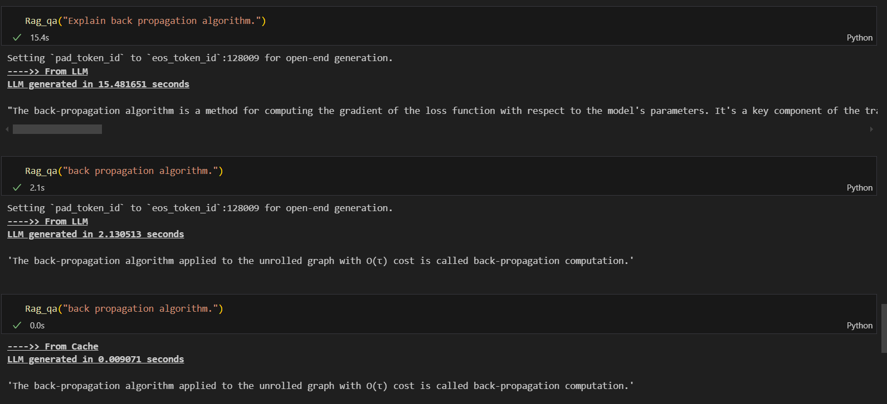

# Gemma2(9b) Llama3-8B-Finetune-and-RAG

- This repository contains code with the Gemma2 model, which has 9 billion parameters.
- Additionally fine-tuning the Llama3 8B model and implementing Retrieval-Augmented Generation (RAG). Llama3-8B-Finetune-and-RAG focuses on fine-tuning the Llama3 model and utilizing RAG for enhanced performance in various tasks.Llama3 8B is a powerful language model developed by Meta, containing 8 billion parameters. It is designed to understand and generate human-like text, making it useful for a wide range of natural language processing tasks.

### Project:1
- Integration with Gemma2 9B model for enhanced performance
- In this project I give incorrect sentence and this model successfully give correct sentence with proper Reason.
- **What is Gemma2 9B??**
Gemma2 9B is another advanced language model included in this repository. It has 9 billion parameters, providing even greater capability for understanding and generating text. The inclusion of Gemma2 offers additional options for fine-tuning.
- 
  
### Project:2
- In this project i give one deep learning book and ask question from this book, So llama3 model generate generate succesful correct answer from this book. 
- 
- **What is Retrieval-Augmented Generation (RAG)??**
RAG is a technique that combines retrieval-based and generative models to produce more accurate and contextually relevant text. It retrieves relevant documents from a knowledge base and uses this information to generate responses, improving the quality and relevance of the output.

### Project:3
- Implementing Semantic caching for efficient data retrieval from RAG ==>
- When generating text directly from the Large Language Model (LLM), the process may take over 20 seconds. However, by caching the generated text, subsequent requests for the same text experience significantly reduced response times. This caching mechanism stores previously generated text, allowing for quick retrieval without the need to regenerate it, thus improving response times for repetitive requests. By leveraging this cache, the system optimizes performance and enhances user experience by minimizing wait times for text generation.
- 
- 
- **What is Semantic Cache??**
Semantic caching is a technique used to store and reuse the results of previous queries to improve the efficiency of data retrieval. In the context of RAG, it helps in quickly accessing relevant information without the need to fetch it repeatedly from the knowledge base, thereby speeding up the generation process.


#### Additionally
- Generate text from Fully Supervised finetunig the model 'meta-llama3-8b model and' with "Hemanth-thunder/tamil-open-instruct-v1" Dataset

###### Installation
Clone the repository:
```bash
git clone https://github.com/praveenaiiisc/Gemma2-9B-Llama3-8B-Finetune-and-RAG-Project.git
```

###### Files
- `meta-llama-3-8b.ipynb`: Notebook for initial setup and configuration.
- `meta-llama-3-8b-rag.ipynb`: Text Generation with Rag PipeLine 
- `meta-llama-3-8b-semantic-cache-for-rag.ipynb`: Text Generation with Semantic caching technique Rag PipeLine
- `meta-llama3-8b-fine-tuning.ipynb`: General fine-tuning notebook.
- `gemma2-9b.ipynb`: Notebook for working with the Gemma2 9B model.
